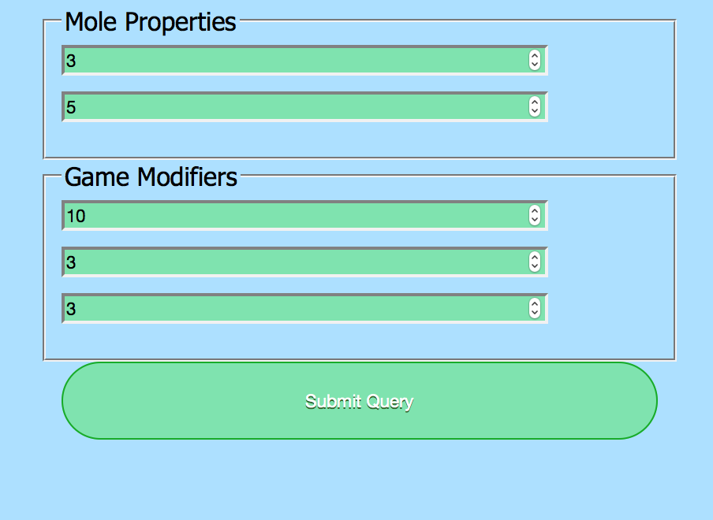
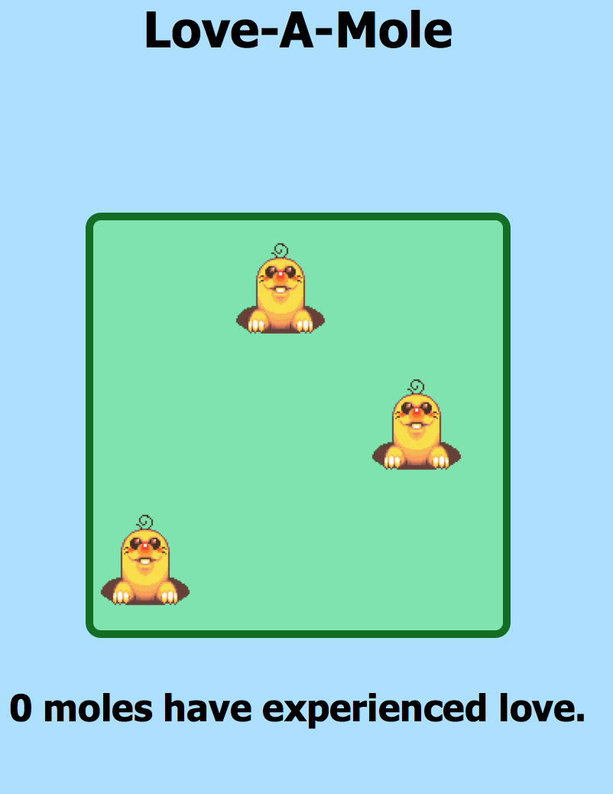
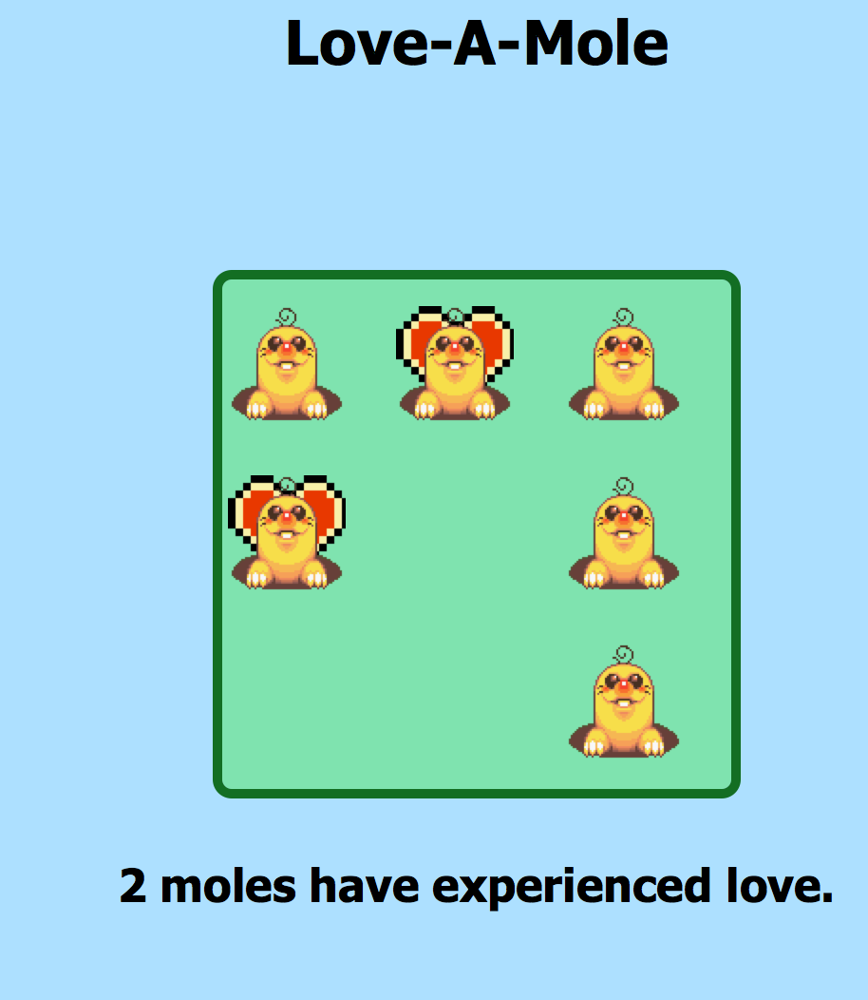

# love-a-mole
During this exercise, you'll apply your knowledge of HTML forms and the [DOM][00].

Your goal is to create a web-based version of [Whack-a-Mole][01]. For those of you unfammiliar with this awesome game, here's the objective: In a limited amount of time, moles will rise from a collection of holes in a randomized order. When a mole appears, a player attempts to strike the mole with a mallet before the mole returns to its hole. Sounds fun, right?!

# Instructions
To complete this exercise, you'll need to follow the following three steps:

## Step 1 of 3: Fork and Clone
Fork and clone this repository to here: 

```javascript
~/workspace
```

If `workspace` doesn't exist, create it: 


```javascript
mkdir ~/workspace
``` 

## Step 2 of 3: Write the Missing Code 
In this repository, you'll notice the following directory structure:

```bash
.
├── css
|   └── whack-a-mole.css
├── images
|   └── found-love.png
|   └── heart.png
|   └── mole.png
├── javascript
|   └── main.js
|   └── mole.js
├── .gitignore
├── index.html
├── README.md
└── whack-a-mole.html

```

Several of the files in above directory is missing code. Your task is to locate the omitted code and then add that code. To give you some direction, you'll be focusing your attention on just these files:

1. `index.html`
2. `css/whack-a-mole.css`
3. `javascript/main.js`
4. `javascript/mole.js`

When you've made some meaningful progress--such as completed the style for a CSS selector or completed the definition of a function--add and commit your work. In other words, don't have your entire solution in one commit!

## Step 3 of 3: Submission
When you're done, push your work to your forked repository. Then copy the URL of your forked repository and paste it into the LMS (learning management system).

## What it Looks Like

A form without good labels (B+ Tyler...)


A board with moles


A Loved Mole



# Creator
Creator: [Tyler Bettilyon][44]

[00]: https://developer.mozilla.org/en-US/docs/Web/API/Document_Object_Model
[01]: https://en.wikipedia.org/wiki/Whac-A-Mole
[44]: https://github.com/teb311
# love-a-mole
